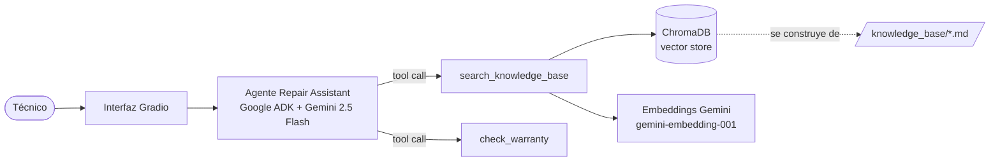

# Mobile Repair Assistant — Agente RAG de Reparación de Celulares

**Español**

Un agente de IA que asiste a técnicos de reparación y personal de soporte en el diagnóstico de problemas comunes de celulares (fallas de carga, pantalla negra, evaluación de garantía) a través de una interfaz conversacional profesional en Gradio.

Todo el proyecto vive en un **único notebook autocontenido para Colab** — sin instalación local. Está construido con **Google ADK** (Agent Development Kit), **Gemini** y un pipeline **RAG** real: la base de conocimiento de reparación se escribe como documentos markdown, se vectoriza con embeddings de Gemini, se indexa en **ChromaDB** y el agente la consulta bajo demanda mediante herramientas.

## Características

- **RAG agéntico** — el agente decide cuándo llamar a `search_knowledge_base` (búsqueda vectorial en ChromaDB) y a `check_warranty` (lógica determinista de garantía), en lugar de llevar la base de conocimiento incrustada en el prompt.
- **Interfaz orientada al técnico** — interfaz Gradio profesional con panel de registro del equipo, indicador de estado de garantía en vivo, botones de acceso rápido para las consultas de servicio más frecuentes y chat de diagnóstico con memoria de sesión.
- **Corre completamente en Colab** — un clic, ejecutar todas las celdas y obtienes un enlace público de Gradio. El nivel gratuito de la API de Gemini es suficiente.
- **Base de conocimiento extensible** — la base de conocimiento es un diccionario Python de documentos markdown dentro del notebook; agrega un documento o una sección `##` y vuelve a ejecutar.
- **Bilingüe** — el asistente responde en español o inglés (seleccionable en la interfaz).

## Arquitectura

1. La base de conocimiento en markdown se divide por secciones, se vectoriza con `gemini-embedding-001` y se guarda en una colección persistente de ChromaDB.
2. Cuando el usuario describe un problema, el agente llama a `search_knowledge_base`, que vectoriza la consulta y recupera los k fragmentos más similares.
3. El agente adapta los pasos de diagnóstico recuperados a la marca/modelo del equipo y responde en el idioma seleccionado.

## Cómo ejecutarlo

1. Consigue una API key gratuita de Gemini en https://aistudio.google.com/apikey.
2. Abre el notebook en Colab (badge de arriba, o sube [`mobile_repair_assistant.ipynb`](mobile_repair_assistant.ipynb)).
3. En Colab, abre el panel de **Secretos** (icono de llave a la izquierda), agrega un secreto llamado `GOOGLE_API_KEY` con tu key y habilita el acceso del notebook.
4. `Entorno de ejecución → Ejecutar todo`. La última celda imprime un enlace público de Gradio — ábrelo y comienza a diagnosticar.

## Estructura del notebook

| Sección | Contenido |
|---|---|
| 1. Setup | Instalación de dependencias y configuración de la API key |
| 2. Base de conocimiento | Documentos markdown de reparación (carga, pantalla negra, garantía) |
| 3. Pipeline RAG | Chunking por secciones, embeddings Gemini, ingesta/recuperación en ChromaDB |
| 4. Herramientas del agente | `search_knowledge_base` y `check_warranty` |
| 5. Agente y runner | Definición del agente ADK y runner de conversación con sesión |
| 6. Interfaz de usuario | UI Gradio profesional, lanzada con enlace público |

## Extender la base de conocimiento

Edita el diccionario `KNOWLEDGE_BASE` en la sección 2: agrega un nuevo documento markdown (o una nueva sección `##` a uno existente) y vuelve a ejecutar el notebook desde esa celda. Cada sección `##` se convierte en un fragmento recuperable independiente.

## Licencia

[MIT](LICENSE)

[MIT](LICENSE)
